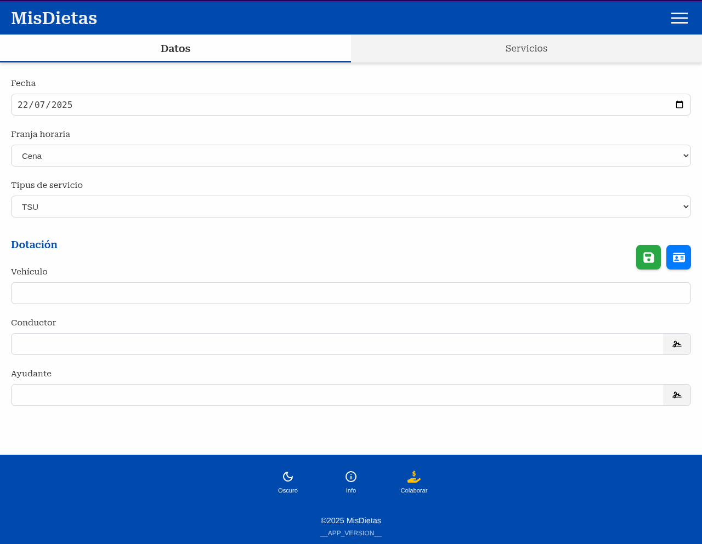
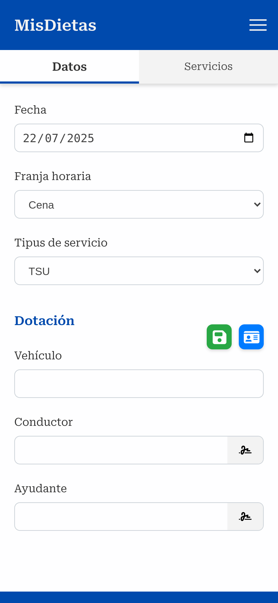

# 🚑 Diet Log

Una aplicació PWA especialment dissenyada per gestionar i documentar dietes i serveis en una empresa de transport sanitari. Permet registrar detalls de serveis, generar informes PDF professionals amb signatures digitals, capturar dades via OCR des de la càmera, i assegurar validacions estrictes per als fluxos de treball de la companyia.

[](LICENSE)  
[]()  
[]()

## 📖 Taula de Continguts

- [🎯 Descripció](#-descripció)
- [✨ Característiques Clau](#-característiques-clau)
- [🏗️ Tecnologies Utilitzades](#️-tecnologies-utilitzades)
- [🚀 Instal·lació i Accés](#-instal·lació-i-accés)
- [📱 Ús](#-ús)
  - [Registrar un Servei](#registrar-un-servei)
  - [Generar Informe PDF](#generar-informe-pdf)
  - [ Gestionar Firmes](#gestionar-firmes)
  - [Captura amb OCR](#captura-amb-ocr)
- [🧪 Tests](#-tests)
- [🤝 Contribucions](#-contribucions)
- [📄 Llicència](#-llicència)
- [📞 Contacte](#-contacte)

---

## 🎯 Descripció

**Diet Log** és una aplicació PWA (Progressive Web App) dissenyada específicament per a una empresa de transport sanitari, simplificant la gestió diària de dietes i serveis. Permet registrar detalls de temps (entrades, sortides, pausas), generar informes PDF professionals amb signatures digitals, i capturar dades via OCR des de la càmera del mòbil. Tot emmagatzemat localment mitjançant IndexedDB, assegurant privacitat, offline-first i compliment amb processos interns de la companyia.

Per què triar Diet Log?

  
_Captura de pantalla de la versió desktop_

  
_Captura de pantalla de la versió mòbil_

---

## ✨ Característiques Clau

- **📝 Registre Flexiblot de Serveis**: Afegeix, edita o esborra serveis amb camps com número, origen/destí, dates i signatures. Suport per múltiples línies de servei en una dieta.
- **📄 Generació Professional de PDFs**: Crea informes PDF automàtics amb totes les dades, signatures del conductor i ajudant, validats per dades temporals.
- **🖊️ Signatures Digitals**: Dibuixa o importa signatures via canvas HTML5, emmagatzemades localment i exportades als PDFs.
- **📸 OCR via Càmera**: Estalvia temps capturant números de servei o detalls directament des de fotos o càmera mòbil amb Tesseract.js.
- **🌙/☀️ Tema Dark/Light**: Canvia entre modes per comoditat visual, amb record automàtic de preferències.
- **🔒 Validacions Estrictes**: Assegura formats correctes (e.g., 9 dígit per números de servei, coherència temporal) amb missatges d'error clar.
- **📱 PWA Offline**: Funciona sense connexió internet, amb instal·lació com app nativa al mòbil.
- **💾 Emmagatzematge Local Seguí**: Dades en IndexedDB, sense núvols o comptes necessaris.
- **🌐 Multilingue i Accessible**: Interfaç intuitiva amb suport per captures de pantalla, i accessibilitat bàsica (alt-texts).

---

## 🏗️ Tecnologies Utilitzades

- **🟨 JavaScript Vanilla**: Lògica principal sense frameworks pesats per major control i rendiment.
- **🗄️ IndexedDB**: Base de dades local del navegador per persistència offline i segura.
- **📋 PDF-lib (^1.17.1)**: Generació i manipulació de PDFs amb signatures i layouts professionals.
- **📷 Tesseract.js (v6)**: Reconnaixement òptic de caràcters (OCR) per càmera i imatges.
- **🎨 HTML5 & SCSS/CSS**: Estructura, estils i animacions responsives, amb minificació automàtica.
- **🔧 Vite + Vitest**: Eines per desenvolupament ràpid, builds i tests unitaris.
- **🔒 Servei Worker**: Cache offline i actualitzacions de recursos per PWA.

---

## 🚀 Instal·lació i Accés

No es necessita instal·lació! Diet Log és una aplicació web pura que funciona al navegador.

1. **Accedeix directament**: Visita [l'enllaç de producció](#) (o host local durant desenvolupament).
2. **Instal·la com PWA** (opcional, per millor experiència offline):
   - Obre el navegador mòbil o desktop.
   - Navega a la pàgina.
   - Fes clic a "Instal·lar App" al banner d'instal·lació o menú del navegador.

Per desenvolupament local:

- Clona el repositori.
- Executa `pnpm install` (seguiu les regles globals per evitar sobreescriptures).
- Executa `pnpm dev` per veure-ho al navegador (porta 3000 típicament).

---

## 📱 Ús

### Registrar un Servei

1. Obre l'app i ves a la pestanya "Serveis".
2. Toca el botó "+" per afegir un nou servei.
3. Omple els camps obligatoris:
   - Número de servei (9 dígit).
   - Origen i destí (màx. 35 caràcters).
   - Horaris d'entrada/sortida (format HH:mm).
   - Opcional: Notes addicionals o pausas.
4. Fes clic a "Guardar". Els validating s'activen automàticament per evitar errors.

**Exemple de validació:**  
Si introdueixes un hora de sortida anterior a l'entrada, veuràs un missatge: "L'hora de sortida no pot ser anterior a l'entrada."

### Generar Informe PDF

1. Assegura't que al menys un servei està registrat.
2. Ves a la pestanya "PDF" o "Informes".
3. Selecciona el periode (diari/setmanal).
4. Toca "Generar PDF".
5. Descarrega el fitxer automàticament amb totes les dades i signatures.

**Nota:** El PDF inclou una taula resumida amb total d'hores, signatures validades, i capçalera amb dades del vehicle/conductor.

### Gestionar Firmes

1. Ves a "Configuració > Firmes".
2. Selecciona si és firma de conductor o ajudant.
3. Dibuixa al canvas amb el ratolí o dit (tactil).
4. Guarda per usar en futurs PDFs.

**Tip:** Importa firmes des d'imatges si ho prefereixes, però s'emmagatzemen localment.

### Captura amb OCR

1. Al formular de servei, toca l'icona càmera al camp número/detalls.
2. Permet accés a la càmera.
3. Fes foto al document (e.g.,.targeta de servei).
4. L'app processa i emplena automàticament els camps.

**Exemple:** Fotografia un número de servei imprès; l'OCR el detecta i el posa al camp, estalviant temps.

---

## 🧪 Tests

Executa tests amb Vitest per assegurar funcions clau:

- Validacions (e.g., `validateServiceNumber()`).
- Generació PDF.
- OCR en entorns simulats.

Exemple comanda:

```bash
pnpm test
```

Els tests usen dades fictícies (sense dades reals d'usuaris).

---

## 🪵 Logging

S'ha incorporat un logger centralitzat (`src/utils/logger.js`) per controlar els missatges. Per utilitzar-lo:

```js
import { logger } from "../utils/logger.js";

const log = logger.withScope("NomDelMòdul");

log.debug("Missatge de debug");
log.info("Informació rellevant");
log.warn("Avís important");
log.error("Error greu", error);
```

En entorns de producció es mostren només avisos i errors. Pots canviar el nivell en temps real amb `logger.setLevel("debug")`. Fitxers pendents de migrar encara fan servir `console.*`; consulta `docs/logging.md` per al seguiment.

---

## 📄 Llicència

Aquest projecte està sota la **Llicència MIT**, permetent ús, modificació i distribució lliure sempre que es mantingui l'autor original.

Per detalls, consulta [LICENSE](./LICENSE).

---

## 📞 Contacte

Tens preguntes o suggerències?

- **GitHub**: [@Medix-Code/diet-log](https://github.com/Medix-Code/diet-log)
- **Email**: (\***\*\*\*\*\*\*\***)

---

> 💡 **Nota d'ús**: Per privacitat, totes les dades s'emmagatzemen localment. No enviïs PDFs amb dades sensibles sense consentiment. Documentat amb ordagla a [privacy-policy.html](./privacy-policy.html).
