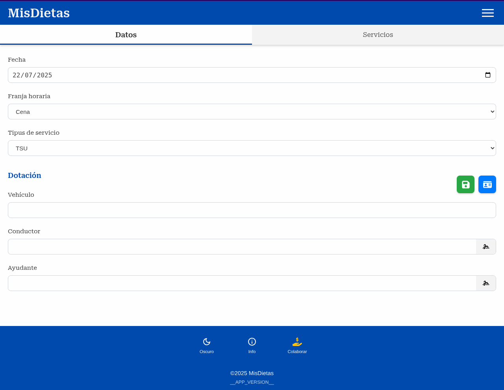
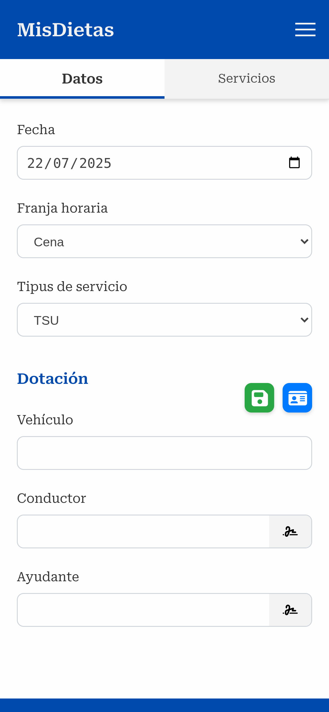

# MisDietas

Aplicación web progresiva orientada a la gestión de dietas, servicios y justificantes operativos en movilidad. El proyecto está pensado para funcionar bien en móvil, reducir fricción en la captura de datos y facilitar la generación de documentación lista para entregar.


## Resumen

MisDietas combina captura rápida de datos, guardado local, soporte offline y generación de PDF en una única interfaz. La aplicación está diseñada como una PWA instalable y prioriza un flujo de trabajo ágil para uso diario.

## Qué ofrece

- Registro y edición de dietas con múltiples servicios.
- Generación de justificantes PDF desde la propia aplicación.
- Captura asistida mediante OCR para acelerar la introducción de datos.
- Gestión de firmas dentro del flujo de trabajo.
- Soporte offline y actualización mediante Service Worker.
- Instalación como aplicación desde navegador compatible.
- Interfaz optimizada para móvil, con onboarding y acciones rápidas.
- Gestión de dietas guardadas, papelera y restauración.
- Plantillas y utilidades auxiliares para acelerar la carga de datos repetitivos.

## Capturas





## Stack técnico

- HTML, SCSS y JavaScript modular.
- Componentes React incrementales para partes concretas de la interfaz.
- `esbuild` para bundling de la aplicación.
- `pdf-lib` para generación de documentos PDF.
- `tesseract.js` para OCR.
- `Vitest` + `jsdom` para tests.
- Cloudflare Worker para despliegue y cabeceras en entorno productivo.

## Estructura del proyecto

```text
.
├── assets/                # Iconos, animaciones e imágenes
├── css/                   # Estilos fuente y compilados
├── src/
│   ├── components/        # Componentes de UI
│   ├── config/            # Constantes y configuración
│   ├── db/                # Persistencia local
│   ├── models/            # Modelos de dominio
│   ├── services/          # Casos de uso y lógica principal
│   ├── ui/                # Interacciones y vistas
│   └── utils/             # Utilidades transversales
├── tests/                 # Suite de pruebas
├── service-worker.js      # Cache y soporte offline
├── _worker.js             # Worker de Cloudflare
└── index.html             # Entrada principal
```

## Requisitos

- Node.js 20 o superior.
- `pnpm` 10.

## Puesta en marcha local

1. Instala dependencias:

```bash
pnpm install
```

2. Genera los assets principales:

```bash
pnpm build
pnpm build:css
```

3. Sirve el proyecto con un servidor estático desde la raíz del repositorio.

Notas:

- El script `pnpm dev` no levanta un servidor; actualmente es solo un placeholder.
- Para probar la experiencia PWA, Service Worker y rutas estáticas, conviene servir la aplicación en local con un servidor real en lugar de abrir `index.html` directamente.

## Scripts disponibles

```bash
pnpm build         # Compila la app JS y actualiza hashes
pnpm build:css     # Compila CSS y actualiza hashes
pnpm test          # Ejecuta la suite de tests
pnpm worker:dev    # Desarrollo del Worker de Cloudflare
pnpm worker:deploy # Despliegue del Worker
pnpm worker:tail   # Logs remotos del Worker
```

## Calidad y pruebas

La base del proyecto cuenta con pruebas unitarias e integradas para validaciones, OCR, flujos de guardado, migraciones y comportamiento de servicios principales.

Ejecución:

```bash
pnpm test -- --run
```

## Despliegue

El repositorio incluye configuración para Cloudflare Worker en [wrangler.toml](wrangler.toml). El sitio productivo está orientado a un despliegue web estático con soporte adicional del Worker para aspectos de entrega y cabeceras.

## Privacidad y tratamiento de datos

Este README evita documentar detalles operativos sensibles o internos sobre el tratamiento de datos. Para la política funcional de privacidad y uso, consulta [privacy-policy.html](privacy-policy.html).

## Estado del proyecto

MisDietas está activo y mantiene una base de código modular con cobertura de pruebas, soporte PWA y orientación clara a uso real en producción.

## Licencia

Proyecto distribuido bajo licencia ISC, tal y como figura en `package.json`.
